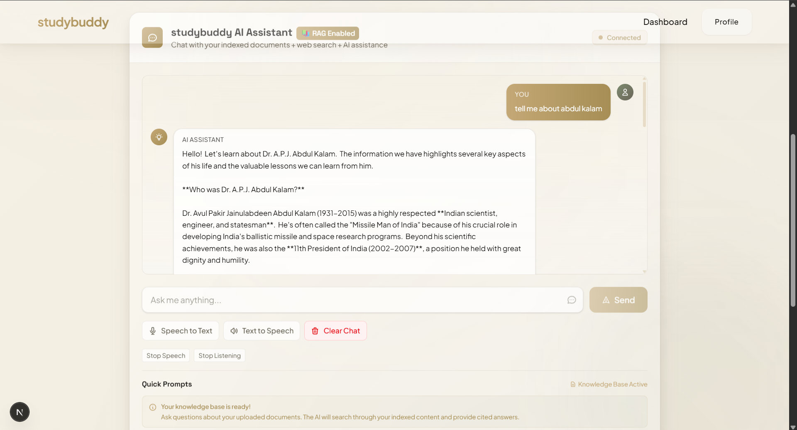
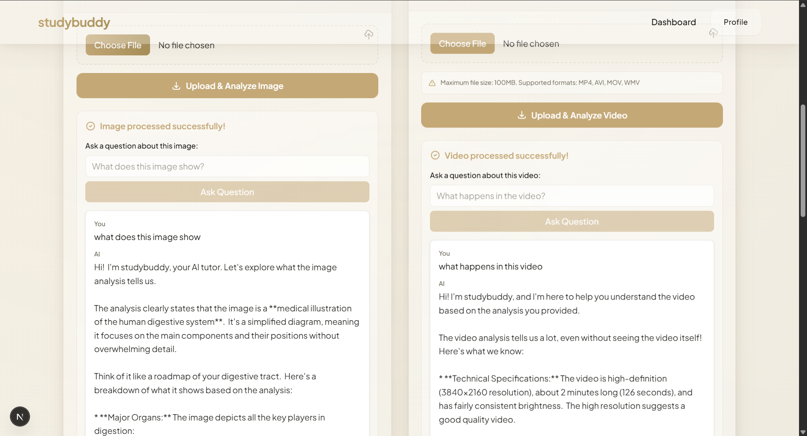
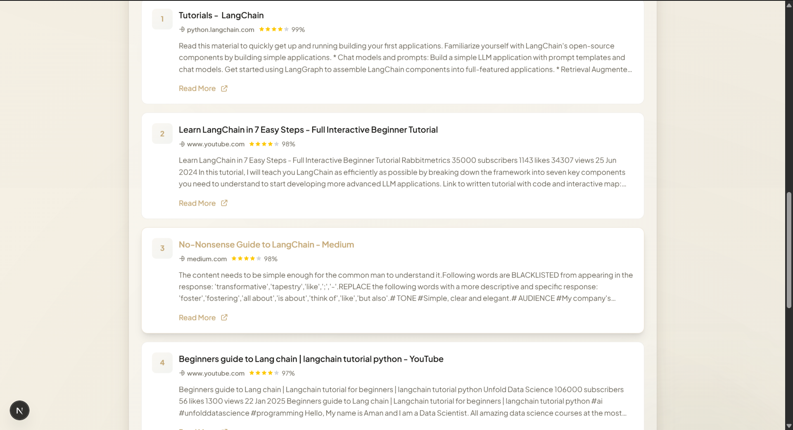

# AI Tutor StudyBuddy

> An intelligent tutoring platform powered by AI, featuring RAG-based document understanding, multimodal content analysis, and natural language interactions.



## 🌟 Features

- **💬 Intelligent Chat** - Context-aware conversations powered by Google's Gemini AI
- **📚 RAG (Retrieval Augmented Generation)** - Upload PDFs and get accurate, source-backed answers
- **🔍 Web Search Integration** - Real-time web search with educational content prioritization
- **🖼️ Image Analysis** - Upload and analyze images with AI-powered insights
- **🎥 Video Processing** - Extract and analyze content from video files
- **🎤 Speech-to-Text** - Convert spoken questions to text
- **🔊 Text-to-Speech** - Listen to AI responses
- **💾 Session Management** - Persistent conversation history

## 🏗️ Architecture

```
┌─────────────────┐
│   Next.js 15    │  Frontend (React 19, Tailwind 4)
│   Port: 3000    │
└────────┬────────┘
         │ Proxy Layer (/api/[...flask])
         ↓
┌─────────────────┐
│   Flask API     │  Backend (Python 3.11)
│   Port: 5500    │
└────────┬────────┘
         │
         ├─→ RAG Pipeline (Vector Store)
         ├─→ Web Search (Tavily/SERP)
         ├─→ Gemini AI (Chat & Analysis)
         └─→ Media Processing (FFmpeg)
```

### Technology Stack

**Frontend**
- Next.js 15 (App Router)
- React 19
- Tailwind CSS 4
- TypeScript

**Backend**
- Flask (Python 3.11)
- Google Generative AI (Gemini)
- Vector database for RAG
- FFmpeg for media processing

## 📋 Prerequisites

Before you begin, ensure you have the following installed:

- **Python 3.11** or higher
- **Node.js 20+** and **npm 10+**
- **ffmpeg** (optional, for audio/video features)
  ```bash
  # Windows (using Chocolatey)
  choco install ffmpeg
  
  # macOS (using Homebrew)
  brew install ffmpeg
  
  # Linux (Ubuntu/Debian)
  sudo apt install ffmpeg
  ```

## 🚀 Getting Started

### 1. Clone and Setup Python Environment

```powershell
# Navigate to project directory
cd C:\Projects\aitutor

# Create virtual environment
python -m venv venv

# Activate virtual environment
# Windows PowerShell:
venv\Scripts\Activate.ps1
# Windows CMD:
venv\Scripts\activate.bat
# Linux/macOS:
source venv/bin/activate

# Install Python dependencies
pip install -r requirements.txt
```

### 2. Configure Environment Variables

Create a `.env` file in the repository root:

```dotenv
# ============================================
# Flask Backend Configuration
# ============================================
FLASK_URL=http://127.0.0.1:5500

# ============================================
# AI Provider (Required)
# ============================================
# Google Gemini API key
GOOGLE_API_KEY=your_google_api_key
# Alternative variable name
GEMINI_API_KEY=your_google_api_key

# ============================================
# Web Search Providers (Optional)
# ============================================
# Tavily API for web search
TAVILY_API_KEY=your_tavily_api_key
# SERP API alternative
SERP_API_KEY=your_serp_api_key

# ============================================
# Supabase (Optional)
# ============================================
# For user authentication and data storage
NEXT_PUBLIC_SUPABASE_URL=your_supabase_url
NEXT_PUBLIC_SUPABASE_ANON_KEY=your_supabase_anon_key
```

**Getting API Keys:**
- **Gemini API**: Visit [Google AI Studio](https://makersuite.google.com/app/apikey)
- **Tavily API**: Sign up at [Tavily](https://tavily.com/)
- **SERP API**: Register at [SerpApi](https://serpapi.com/)
- **Supabase**: Create a project at [Supabase](https://supabase.com/)

### 3. Start the Flask Backend

```powershell
# Navigate to Flask app directory
cd C:\Projects\aitutor\testFrontend\FlaskApp

# Ensure virtual environment is activated
venv\Scripts\Activate.ps1

# Start Flask server
python app.py
```

The Flask API will be available at `http://127.0.0.1:5500`

### 4. Start the Next.js Frontend

```powershell
# Open a new terminal and navigate to web directory
cd C:\Projects\aitutor\web

# Install dependencies (first time only)
npm install

# Start development server
npm run dev
```

Open your browser and navigate to `http://localhost:3000`

## 📁 Project Structure

```
aitutor/
├── aiFeatures/
│   └── python/
│       ├── ai_response.py      # Core AI logic
│       ├── rag_pipeline.py     # RAG implementation
│       ├── web_search.py       # Search integration
│       └── media_processor.py  # Image/video processing
├── testFrontend/
│   └── FlaskApp/
│       └── app.py              # Flask API server
├── web/
│   ├── src/
│   │   ├── app/
│   │   │   ├── api/
│   │   │   │   └── [...flask]/ # API proxy routes
│   │   │   └── page.tsx        # Main UI
│   │   └── components/         # React components
│   ├── next.config.ts          # Next.js configuration
│   └── package.json
├── .env                        # Environment variables
└── requirements.txt            # Python dependencies
```

## 🔌 API Endpoints

### Health & Status

| Method | Endpoint | Description |
|--------|----------|-------------|
| GET | `/` | Service health check |
| GET | `/health` | Detailed health status with environment info |
| GET | `/status` | Vector store initialization status |

### Chat & AI

| Method | Endpoint | Description | Body |
|--------|----------|-------------|------|
| POST | `/ask` | Send a chat message | `{ query: string, session_id?: string, web_search_results?: object }` |

**Response:**
```json
{
  "response": "AI-generated answer",
  "hasRetrieval": false,
  "hasWebSources": true,
  "sessionId": "session-uuid"
}
```

### RAG (Document Processing)

| Method | Endpoint | Description | Body |
|--------|----------|-------------|------|
| POST | `/initialize-rag` | Upload and process documents | multipart/form-data: `files[]` or `folder` path |

### Web Search

| Method | Endpoint | Description | Body |
|--------|----------|-------------|------|
| POST | `/enhanced-search` | Perform web search | `{ query: string, search_type?: "educational" }` |

### Media Processing

| Method | Endpoint | Description | Size Limit |
|--------|----------|-------------|------------|
| POST | `/process-image` | Analyze an image | 10 MB |
| POST | `/process-video` | Process video content | 100 MB |
| POST | `/ask-image` | Ask questions about processed image | - |
| POST | `/ask-video` | Ask questions about processed video | - |

### Speech

| Method | Endpoint | Description |
|--------|----------|-------------|
| POST | `/speech-to-text` | Convert audio to text |
| POST | `/text-to-speech` | Generate audio from text |
| POST | `/stop-speech` | Stop TTS playback |
| POST | `/stop-listening` | Stop STT recording |

**Accessing via Frontend Proxy:**
All Flask endpoints are accessible through the Next.js frontend at `/api/<endpoint-path>` (e.g., `/api/ask`, `/api/initialize-rag`)

## 💻 Development Scripts

### Frontend (from `web/` directory)

```bash
npm run dev      # Start development server (port 3000)
npm run build    # Create production build
npm start        # Start production server
npm run lint     # Run ESLint
npm run type-check # Run TypeScript checks
```

### Backend (from `testFrontend/FlaskApp/` directory)

```bash
python app.py              # Start Flask server
python -m pytest tests/    # Run tests (if configured)
```

## 🎨 Features in Action

### Intelligent Chat Interface

*Natural language conversations with context awareness*

### Document Analysis

*Upload PDFs and get accurate, source-backed answers*

### Web Search Integration

*Real-time web search with educational content*

## 🔧 Configuration

### Flask Configuration

The Flask app can be configured via environment variables:

```python
# app.py settings
HOST = os.getenv('FLASK_HOST', '127.0.0.1')
PORT = int(os.getenv('FLASK_PORT', 5500))
DEBUG = os.getenv('FLASK_DEBUG', 'False').lower() == 'true'
```

### Next.js Configuration

Environment variables are loaded from the monorepo root via `web/next.config.ts`. Variables prefixed with `NEXT_PUBLIC_` are exposed to the client.

## 🐛 Troubleshooting

### Common Issues

**Flask server won't start:**
```bash
# Check if port 5500 is already in use
netstat -ano | findstr :5500

# Kill the process or change FLASK_PORT in .env
```

**Next.js can't connect to Flask:**
```bash
# Verify FLASK_URL in .env points to correct address
# Ensure Flask server is running before starting Next.js
```

**Missing API key errors:**
```bash
# Verify .env file exists in repository root
# Check that GOOGLE_API_KEY or GEMINI_API_KEY is set
# Restart both servers after updating .env
```

**FFmpeg not found:**
```bash
# Install ffmpeg (see Prerequisites section)
# Ensure ffmpeg is in your system PATH
```

## 📝 License

This project is licensed under the MIT License - see the LICENSE file for details.

## 🤝 Contributing

Contributions are welcome! Please feel free to submit a Pull Request.

## 📧 Support

For issues and questions, please open an issue on the GitHub repository.

---

**Built with ❤️ using Next.js, Flask, and Google Gemini AI**
